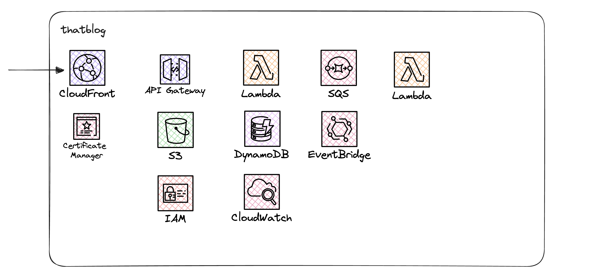

# thatblog

I keep trying to build out a Serverless blog platform for years. Something to take on the likes of Wordpress & Medium, but with the benefits of self-hosting on AWS.

The problem? Me :joy: I keep "_refactoring_" to make it extensible - the last iteration I spent months on a `datastore`, a layer between the application & the database, so that in the future you could theoretically use MySQL, Postgres or MongoDB instead of DynamoDB. And I wanted to be able to deploy to AWS or GCP? It's all too much! :raised_hands:

So new plan for 2025: Build this out in public. Build this out for AWS only - and to focus on a single implementation, no real refactors until it's "released".

- Build this project out in public
- Build up the self-hosted edition, and consider a hosted edition once a "_version 1_" is reached

The initial architecture will look like:

- Cloudfront CDN to cache static assets & reduce costs
- Certificate Manager if a custom domain is desired
- API-Gateway to route traffic to an admin application, an API application & a frontend application
- S3 for static assets & content uploads
- Specific IAM execution roles
- Lambda for handling API requests
- DynamoDB to store all data/content
- Cloudwatch logs for all application logs
- SQS queues for background processing
- EventBridge schedules to kick off cron jobs
- Lambda for handling background jobs
